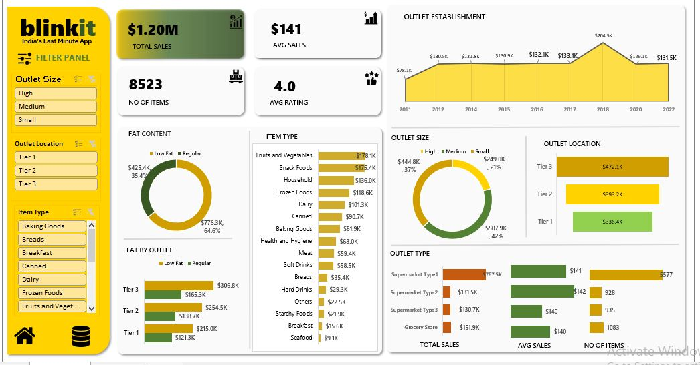

 Blinkit Sales Analysis Dashboard
 📌 Project Overview
This project presents an interactive **Blinkit Sales Analysis Dashboard** created using **Microsoft Excel**.
The dashboard provides a comprehensive view of sales performance across different product categories, outlet sizes, outlet locations, outlet types, fat-content segments, and outlet establishment years.
The main objective of this project is to transform sales data into meaningful business insights that can help understand outlet performance, product demand, and sales trends.
---
Dashboard Preview
The dashboard provides an interactive overview of Blinkit's sales performance.

---
#  Tools & Technologies
- **Microsoft Excel**
- Excel Pivot Tables
- Pivot Charts
- Data Cleaning
- Data Analysis
- Data Visualization
- Dashboard Development
---
# Key Performance Indicators
The dashboard highlights the following major KPIs:
| KPI | Value |
|  Total Sales | **$1.20M** |
|  Average Sales | **$141** |
|  Number of Items | **8,523** |
| Average Rating | **4.0** |
These KPIs provide a quick overview of the overall business performance.
---
#  Dashboard Analysis

## 1. Outlet Establishment Analysis

The **Outlet Establishment** chart shows sales performance across different outlet establishment years.
---
## 2. Fat Content Analysis
The **Fat Content** section compares sales generated by:
- Low Fat products
- Regular products
---
## 3. Item Type Analysis
The **Item Type** chart compares sales across different product categories.
----
### Top-performing categories
Based on the dashboard, **Fruits and Vegetables** and **Snack Foods** are among the highest-selling categories.

This indicates strong customer demand for these product groups.
---
## 4. Outlet Size Analysis
The **Outlet Size** chart compares sales performance among:
- High
- Medium
- Small
The dashboard indicates that **Medium-sized outlets contribute the highest share of sales**, followed by High-sized and Small-sized outlets.
This analysis can help businesses understand how outlet size relates to sales performance.
---
## 5. Outlet Location Analysis
The **Outlet Location** section compares sales across:
- Tier 1
- Tier 2
- Tier 3
According to the dashboard:
- **Tier 3 outlets** generate the highest sales.
- **Tier 2 outlets** generate the second-highest sales.
- **Tier 1 outlets** generate the lowest sales among the three location tiers.
This suggests that outlet performance is not necessarily highest in Tier 1 locations.
---
## 6. Outlet Type Analysis
The dashboard compares different outlet types based on:

- Total Sales
- Average Sales
- Number of Items
The outlet types analyzed include:
- Supermarket Type 1
- Supermarket Type 2
- Supermarket Type 3
- Grocery Store
This allows businesses to compare outlet formats and identify which types contribute most effectively to sales.
---
#  Key Insights
Based on the dashboard analysis, the following insights can be identified:
### 1. Strong Overall Sales Performance
The business generates approximately **$1.20 million in total sales**, indicating a strong overall sales volume.
### 2. Regular-Fat Products Lead Sales
Regular-fat products contribute approximately **64.6% of sales**, compared with approximately **35.4% from Low-Fat products**.
This indicates stronger sales performance for Regular-fat products.
### 3. Tier 3 Outlets Perform Best
Tier 3 outlets generate approximately **$472.1K in sales**, making them the strongest-performing location tier.
### 4. Medium-Sized Outlets Have the Largest Contribution
Medium-sized outlets contribute approximately **42% of total sales**, representing the largest share among the outlet-size categories.
### 5. Fruits and Vegetables Are a Top Category
Fruits and Vegetables generate approximately **$178.1K in sales**, making them the highest-selling category shown in the item-type analysis.
### 6. Snack Foods Are Another Strong Category
Snack Foods generate approximately **$157.4K**, making them another major contributor to total sales.
### 7. Customer Ratings Are Strong
The dashboard reports an **average rating of 4.0**, indicating generally positive customer feedback.
### 8. Outlet Establishment Has an Impact on Sales
Sales vary across outlet establishment years, with **2018 showing the highest sales level** in the displayed trend.
---
# Business Objectives
The dashboard was designed to answer the following business questions:
1. What is the total sales performance?
2. What is the average sales value?
3. Which product categories generate the highest sales?
4. Which outlet size performs best?
5. Which outlet location tier generates the highest sales?
6. Which outlet type contributes the most sales?
7. How do Regular and Low-Fat products compare?
8. How has sales performance changed across outlet establishment years?
9. How many items are represented in the dataset?
10. What is the average customer rating?
---
# Business Recommendations
Based on the dashboard insights, the following recommendations can be considered:
### 1. Focus on High-Demand Categories
The business should maintain strong inventory levels for high-performing categories such as **Fruits and Vegetables** and **Snack Foods**.
### 2. Strengthen Tier 3 Outlets
Since Tier 3 outlets generate the highest sales, the business could explore additional investment, inventory optimization, and expansion opportunities in these locations.
### 3. Optimize Medium-Sized Outlets
Medium-sized outlets contribute the largest share of sales. Improving product availability and operational efficiency in these outlets could further increase revenue.
### 4. Analyze Customer Preferences
The higher contribution from Regular-fat products suggests that customer preferences should be considered when planning product assortment and inventory.
### 5. Monitor Outlet Performance Over Time
Sales trends by establishment year should be monitored regularly to identify successful outlet strategies and improve the performance of newer or weaker outlets.

